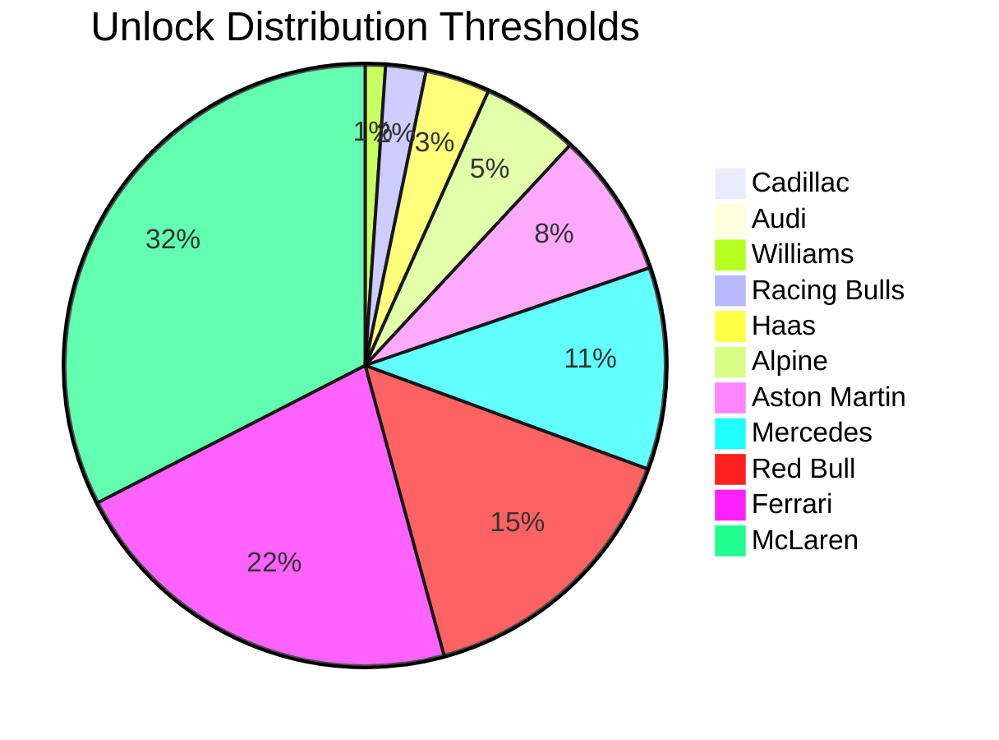
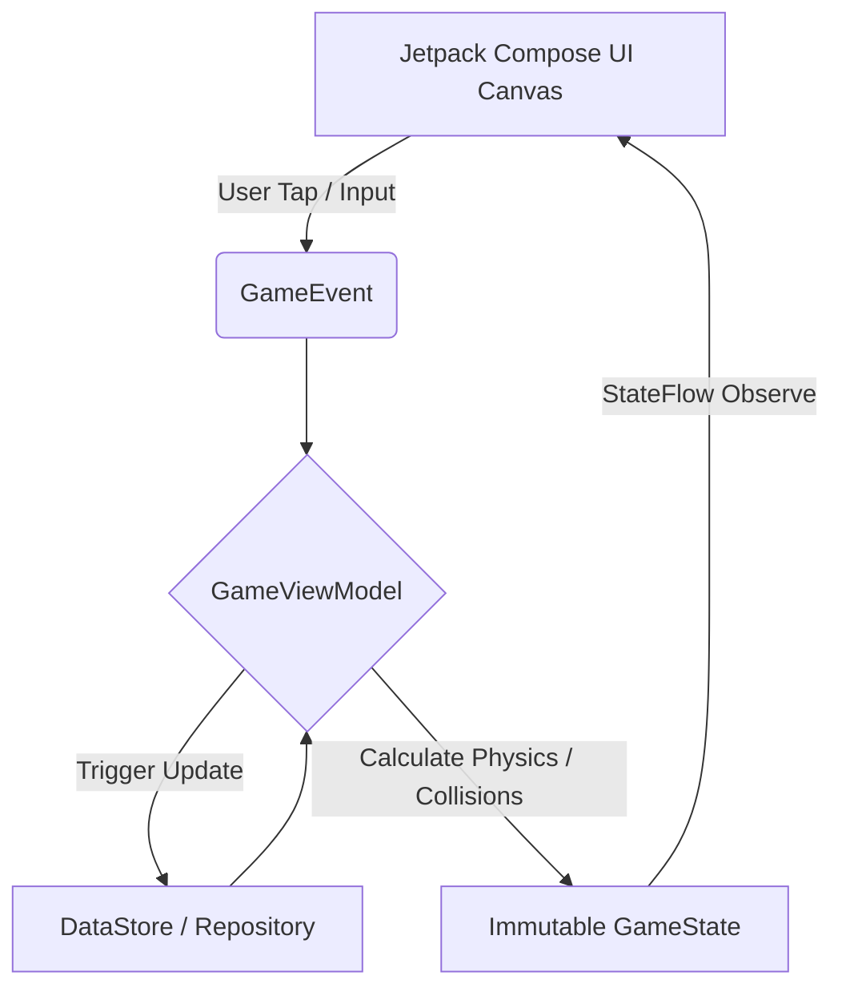
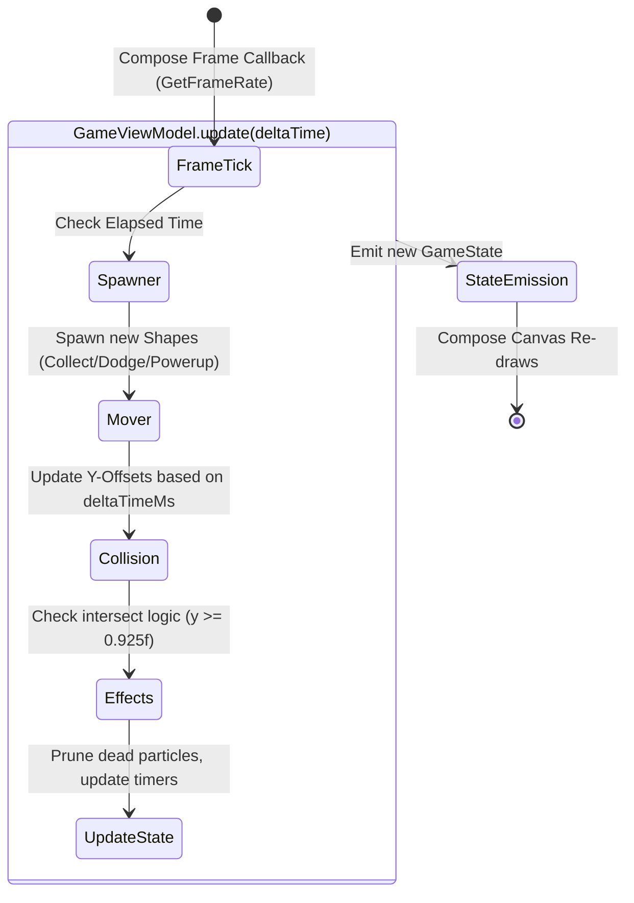

<div align="center">
  <h1>TwoCars: Collect & Dodge</h1>
  <p><strong>An adrenaline-fueled, F1-themed "Collect & Dodge" game built with modern Android technologies.</strong></p>

  [](https://kotlinlang.org)
  [](https://developer.android.com/jetpack/compose)
  []()
  []()
  []()
</div>

---

**TwoCars** is a high-performance Android game where you control two cars simultaneously. Each car switches between two lanes, forcing you to multitask: collect targets, dodge obstacles, master the combo multiplier system, and survive as long as possible!

The game progressively speeds up, testing your reaction time as you aim to unlock iconic F1 constructors. Built entirely without a 3rd-party game engine—rendering and gameloop logic are purely powered by **Jetpack Compose** and **Kotlin Coroutines**.


---

## Features 

* **Dual Car Control**: Manage two vehicles at the exact same time! Car 1 navigates the left two lanes, while Car 2 navigates the right two lanes.
* **Custom Physics & Game Engine**: Runs completely on Jetpack Compose using delta-time calculations for a buttery-smooth 60 FPS experience.
* **Progressive Difficulty**: The game naturally speeds up, reducing separation spawn times as your score thresholds increase (starts easing at 50, gets brutal past 500).
* **Combo System**: Chain collections within a 1-second window to build multipliers (up to 5x points!) and execute "Near Misses" for bonus points.
* **Multiple Game Modes**: 
  * ♾️ **Endless Survival**: Classic mode, survive as long as you can.
  * ⏱️ **Timed Challenge**: A frantic 90-second dash to accumulate the highest score.
* **Dynamic Visual Effects**: Screen shake on collision, custom particle engines for power-ups and collections, and floating score pop-ups.
* **Remote Configuration**: Leverage Firebase Remote Config to dynamically update F1 team names and visual elements without pushing App Updates.

---

## Dynamic Power-Ups

Gain a competitive edge during gameplay by collecting special power-up shapes:

| Power-Up | Effect |
| :---: | :--- |
| 🧲 **Magnet** | Automatically pulls collectibles towards your cars without needing to switch lanes. |
| 🛡️ **Shield** | Protects you from a single direct collision with an obstacle. |
| ⏱️ **Slow-Mo** | Reduces the spawn rate and fall velocity of the game, granting crucial reaction time. |
| ✖️ **Double Points** | Multiplies your base and combo scoring limits temporarily. |
| 👻 **Ghost** | Allows your cars to phase right through red square obstacles unharmed. |

---

## Unlockable F1 Constructors

As you play, your cumulative score is saved asynchronously using **Preferences DataStore**. Reach the following global milestones to unlock elite F1 teams and apply their liveries to your cars!



---

## Technical Architecture

The architecture relies entirely on Unidirectional Data Flow (UDF) managed via the Model-View-Intent (MVI) pattern. 

### MVI State Flow
UI events (Taps, System Back) are emitted as `GameEvent` to the `GameViewModel`. The ViewModel processes the intent, updates internal properties, computes the next frame, and emits an immutable `GameState` back to Jetpack Compose.



### Game Engine Loop Architecture
Unlike traditional View-based Android apps, TwoCars computes object coordinates manually on every frame render tick. 



### Tech Stack Breakdown
* **UI**: Jetpack Compose (`Canvas`, custom vector rendering, `Animatable`)
* **Core Language**: Kotlin
* **Concurrency**: Coroutines (`viewModelScope`, custom dispatchers) & StateFlow
* **Architecture**: MVI (Model-View-Intent), clean separation of concerns.
* **Dependency Injection**: Dagger Hilt
* **Local Persistence**: Preferences DataStore (High Scores, Achievements, Unlocked Teams)
* **Backend Integration**: Firebase Remote Config & Firebase Crashlytics

---

## How to Play

1. **Tap Left Side**: Switches the lane of the left car (between Lane 1 and 2).
2. **Tap Right Side**: Switches the lane of the right car (between Lane 3 and 4).
3. **Objective**: Collect ALL the circle targets. Missing a single green circle ends the run!
4. **Avoid**: Dodge all square obstacles. Hitting a red square results in immediate Game Over (unless Shielded).
5. **Chain Combos**: Gather consecutive circles quickly to build a 2x, 3x, and 5x multiplier. Wait too long, and the combo breaks.

---

## Getting Started

### Prerequisites
* **Android Studio Ladybug** (or newer)
* **JDK 17**
* An Android Device or Emulator running API 26+

### Build Instructions
1. Clone the repository:
   ```bash
   git clone https://github.com/amEya911/TwoCars.git
   ```
2. Open the project in **Android Studio**.
3. Let Gradle sync and download the required Compose and Firebase dependencies.
4. *Important*: If Firebase google-services.json is not present locally, ensure you connect your own Firebase project or the Remote Config fallback defaults will be utilized.
5. Hit **Run** (`Shift + F10`) to deploy to your device. 

## Contributions
Feel free to contribute by opening issues or submitting pull requests! Whether it's adding a new power-up, refining the particle physics, or squashing a bug, all contributions are highly appreciated.
